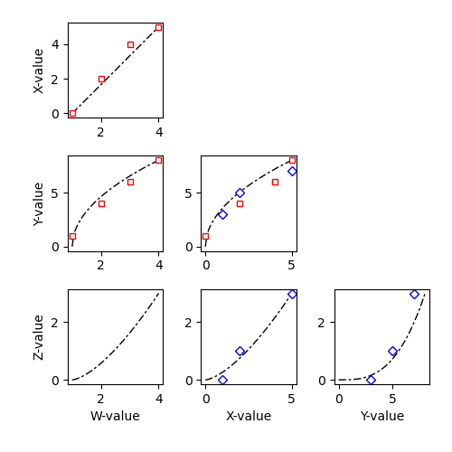

# Stairplots

Simple library to create stairplots in `matplotlib`. Stairplots provide a simple way to visualize multidimensional data, with each dimension plotted against every other dimension.

## Example

```py
### GENERATE SOME RANDOM DATA ###

from numpy.random import default_rng
from numpy import cov, zeros, eye

labels = ['aaa', 'bbb', 'ccc', 'ddd']
N = len(labels)
Ndata = 1000

rng = default_rng(1)

seed_data = rng.multivariate_normal(
	mean = zeros((N,)),
	cov = eye(N),
	size = 3,
	)
C = cov(seed_data.T)

data = rng.multivariate_normal(
	mean = [1, 2, 4, 8],
	cov = C,
	size = Ndata,
	)

### CREATE THE STAIRPLOTS ###

from stairplots import *
import matplotlib.pyplot as ppl

ppl.figure(figsize = (6,6))
axes = stairplot_axes(labels)
for j in range(N):
	for k in range(N):
		if j<k:
			stairplot(
				{j: data[:,j], k: data[:,k]},
				axes,
				'r+',
				alpha = 0.1,
				)
ppl.savefig('stairplots.png')
```

Result:

<div align="center">

</div>