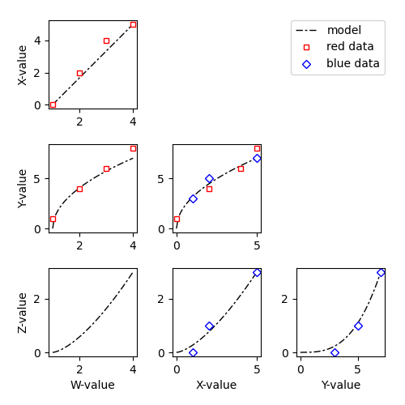

# Stairplots

Simple library to create stairplots in `matplotlib`. Stairplots provide a simple way to visualize multidimensional data, with each dimension plotted against every other dimension. The main goal is to let the user specify data and/or model predictions in arbitrary subsets of the multi-dimensional space and let the code take care of where to plot these values. Originally inspired by [corner.py](https://github.com/dfm/corner.py).

## Simple example

You might have one set of (*w*, *x*, *y*) data, another set of (*x*, *y*, *z*) data, and a model predicting (*w*, *x*, *y*, *z*) trajectories.

```py
import numpy as np

data_1 = dict(
    w = np.array([1, 2, 3, 4]),
    x = np.array([0, 2, 4, 5]),
    y = np.array([1, 4, 6, 8]),
    )

data_2 = dict(
    x = np.array([1, 2, 5]),
    y = np.array([3, 5, 7]),
    z = np.array([0, 1, 3]),
    )

t = np.linspace(0, 1)
model = dict(
    w = 3 * t + 1,
    x = 5 * t,
    y = 8 * t**.5,
    z = 3 * t**1.5,
    )
```

In that case, you could plot everything by simply calling:


```py
import matplotlib.pyplot as ppl
from stairplots import *

ppl.figure(figsize = (5,5))

sp = Stairplots(
    fields = ['w', 'x', 'y', 'z'],
    labels = ['W-value', 'X-value', 'Y-value', 'Z-value'],
    )

sp.plot(model, 'k-', lw = 1, dashes = (6,2,2,2))
sp.plot(data_1, 'ws', mec = 'r', mew = 1, ms = 5)
sp.plot(data_2, 'wD', mec = 'b', mew = 1, ms = 5)

ppl.savefig('stairplots.png')
```


<div align="center">

</div>